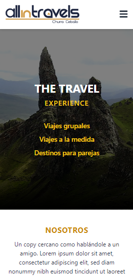
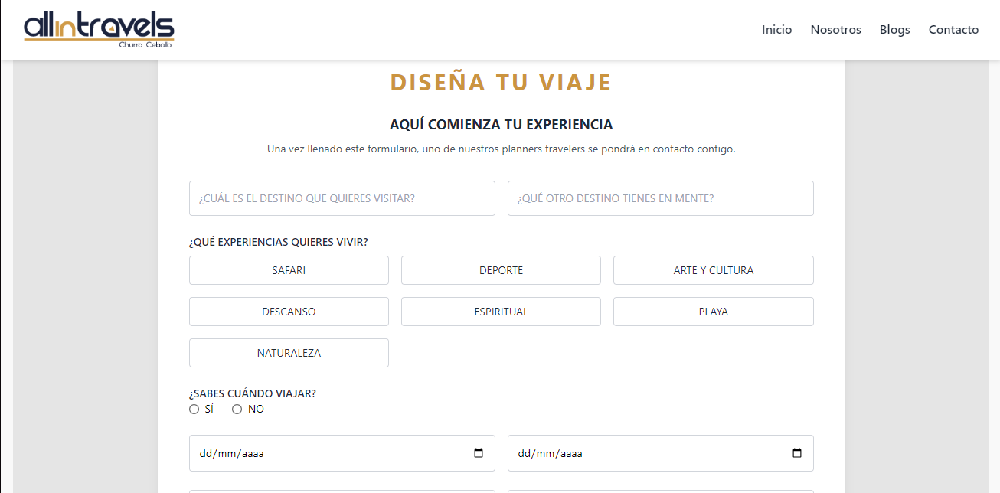

# All in Travels Frontend

## 🚀 ¿Cómo correr el proyecto?

Para ejecutar el proyecto en tu máquina local, sigue estos pasos:

```bash
npm install
npm start
```

Esto instalará las dependencias necesarias y arrancará el servidor de desarrollo.

---

## 📂 Estructura del Proyecto

El proyecto está organizado de la siguiente manera:

```
📦 src
 ┣ 📂 components   # Componentes reutilizables como Navbar, Footer, Cards, Formularios
 ┣ 📂 pages        # Páginas principales (Home, Nosotros, Blogs, Contacto)
 ┣ 📂 services     # Conexiones con la API
 ┣ 📂 assets       # Imágenes y recursos estáticos
```

---

## 📋 Requerimientos

Este proyecto utiliza las siguientes tecnologías:

- ✅ **React** (CRA)
- ✅ **Tailwind CSS** para estilos
- ✅ **Consumo de API real** con `fetch` y `axios`
- ✅ **Diseño Responsive** adaptado a móviles
- ✅ **Formularios con POST a la API**

---

## 🖼 Vista Previa del Proyecto

### 🌍 Versión Web


### 📱 Versión Móvil




### 📌 Formulario de Contacto




### 📰 Blogs


---

## 📡 Consumo de API

Las principales llamadas a la API se encuentran en `src/services/api.js` y se usan para:

- Obtener banners `GET /api/get-banners/`
- Obtener categorías `GET /api/get-categories/`
- Obtener blogs `GET /api/get-blogs/`
- Suscribirse a newsletter `POST /api/set-newsletter/`

---

## 🛠 Instalación y Configuración

Si deseas modificar el proyecto o contribuir:

1. **Clona el repositorio**

   ```bash
   git clone https://github.com/tu_usuario/all-in-travels.git
   ```

2. **Entra en la carpeta del proyecto**

   ```bash
   cd all-in-travels
   ```

3. **Instala dependencias**

   ```bash
   npm install
   ```

4. **Ejecuta el servidor**

   ```bash
   npm start
   ```

Ahora puedes ver la aplicación en `http://localhost:3000/` 🚀

---

## 📜 Licencia

Este proyecto está bajo la licencia MIT. Puedes usarlo y modificarlo libremente.


